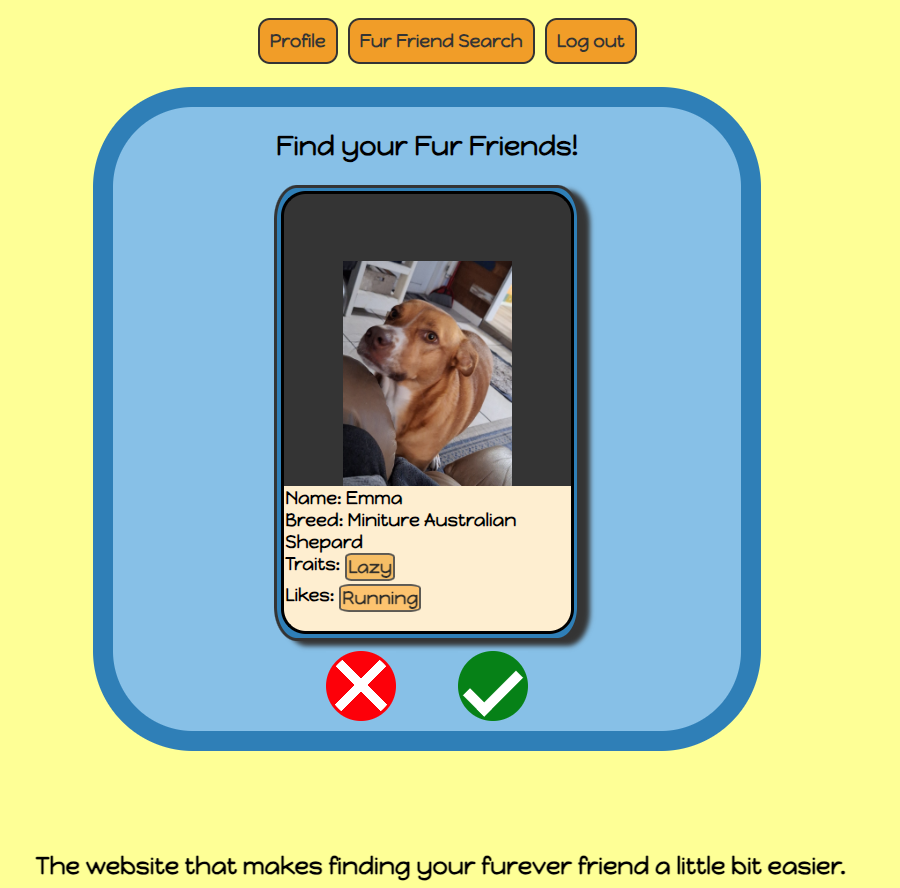

# Fur Friends

## What is it?

Fur friends is an app that helps with the perilous search for that perfect companion. Fur friends is a place for Rescues, Shelters, and Fosters to display their loved ones in hopes for the perfect match with a want to be animal owner.

## All The Links

* [Planning Materials](https://trello.com/b/Pv5JLJeI/animal-swipe)
* [Deployed Site](https://fur-friend-app-7f1a72d680b7.herokuapp.com/)

## Attributions

* [~Q](https://docs.djangoproject.com/en/5.1/topics/db/queries/)

* [django admin](https://docs.djangoproject.com/en/dev/ref/contrib/admin/#django.contrib.admin.ModelAdmin.list_display)

* [default image](https://www.freepik.com/free-vector/paw-print-heart-connected_77951301.htm#query=dog%20paw%20outline&position=6&from_view=keyword&track=ais_hybrid&uuid=de074506-c2b1-4c38-82f0-0377340c8c88)

* [Phone Numbers](https://stackoverflow.com/questions/19130942/whats-the-best-way-to-store-a-phone-number-in-django-models)

* [enctype.pt1](https://stackoverflow.com/questions/680770/django-imagefield-not-working-properly-via-modelform)

* [endctype.pt2](https://stackoverflow.com/questions/4526273/what-does-enctype-multipart-form-data-mean)

* [values_list.pt1](https://stackoverflow.com/questions/53171513/multi-valued-field-in-django)

* [values_list.pt2](https://stackoverflow.com/questions/37205793/django-values-list-vs-values)

## technologies Used

* Github
* Visual Studio Code
* CSS
* Python
* Django
* Google Fonts

## Next Steps

* Would like to implement JS with Ajax or something similar, to help with the user interactivity and not needing to refresh the page.

* would like to better refine the random search for the animal cards to display

* would like to address heroku issue with storing files uploaded during deployment.
